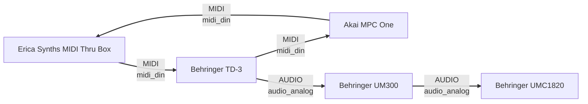

```mermaid
flowchart LR

    erica_midi_thru["Erica Synths MIDI Thru Box"]
    mpc_one["Akai MPC One"]
    td3["Behringer TD-3"]
    um300["Behringer UM300"]
    umc1820["Behringer UMC1820"]

    erica_midi_thru -->|"MIDI<br>midi_din"| td3
    mpc_one -->|"MIDI<br>midi_din"| erica_midi_thru
    td3 -->|"MIDI<br>midi_din"| mpc_one
    td3 -->|"AUDIO<br>audio_analog"| um300
    um300 -->|"AUDIO<br>audio_analog"| umc1820

    linkStyle default stroke-width:2px;
```