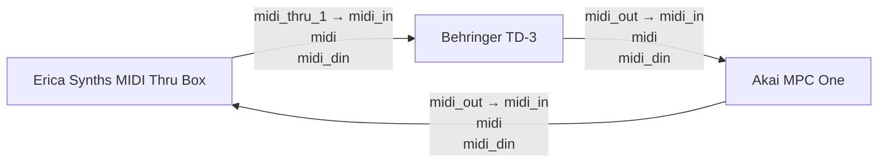

```mermaid
flowchart LR

    erica_midi_thru["Erica Synths MIDI Thru Box"]
    mpc_one["Akai MPC One"]
    td3["Behringer TD-3"]

    erica_midi_thru -->|"midi_thru_1 → midi_in<br>midi<br>midi_din"| td3
    mpc_one -->|"midi_out → midi_in<br>midi<br>midi_din"| erica_midi_thru
    td3 -->|"midi_out → midi_in<br>midi<br>midi_din"| mpc_one

```