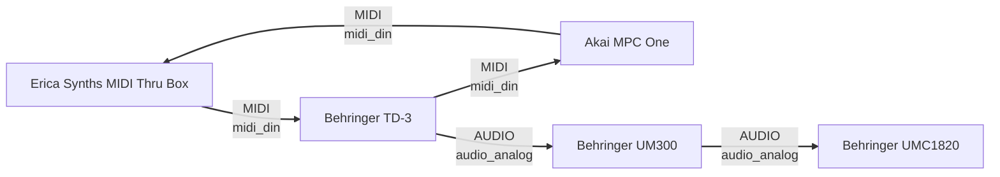

# Studio

> Digital Twin – automatically generated overview

## Current Signal Routing

## Port Status

# Studio Port Status

| Gerät | Port | Richtung | Anschluss | Transport | Status | Gegenstelle | Kabel |
|---|---|---|---|---|---|---|---|
| Erica Synths MIDI Thru Box | MIDI IN | input | din5 | midi_din | 🟢 belegt | mpc_one | midi_din_001 |
| Erica Synths MIDI Thru Box | MIDI THRU 1 | output | din5 | midi_din | 🟢 belegt | td3 | midi_din_002 |
| Erica Synths MIDI Thru Box | MIDI THRU 2 | output | din5 | midi_din | ⚪ frei | – | – |
| Erica Synths MIDI Thru Box | MIDI THRU 3 | output | din5 | midi_din | ⚪ frei | – | – |
| Erica Synths MIDI Thru Box | MIDI THRU 4 | output | din5 | midi_din | ⚪ frei | – | – |
| Erica Synths MIDI Thru Box | MIDI THRU 5 | output | din5 | midi_din | ⚪ frei | – | – |
| Erica Synths MIDI Thru Box | MIDI THRU 6 | output | din5 | midi_din | ⚪ frei | – | – |
| Erica Synths MIDI Thru Box | MIDI THRU 7 | output | din5 | midi_din | ⚪ frei | – | – |
| Erica Synths MIDI Thru Box | MIDI THRU 8 | output | din5 | midi_din | ⚪ frei | – | – |
| Erica Synths MIDI Thru Box | Power | input | dc |  | ⚪ frei | – | – |
| Akai MPC One | MIDI IN | input | din5 | midi_din | 🟢 belegt | td3 | midi_din_003 |
| Akai MPC One | MIDI OUT | output | din5 | midi_din | 🟢 belegt | erica_midi_thru | midi_din_001 |
| Akai MPC One | Audio IN L | input | jack_6_35_trs |  | ⚪ frei | – | – |
| Akai MPC One | Audio IN R | input | jack_6_35_trs |  | ⚪ frei | – | – |
| Akai MPC One | Audio OUT L | output | jack_6_35_trs |  | ⚪ frei | – | – |
| Akai MPC One | Audio OUT R | output | jack_6_35_trs |  | ⚪ frei | – | – |
| Akai MPC One | Headphones | output | jack_3_5_trs |  | ⚪ frei | – | – |
| Akai MPC One | CV/Gate 1 | output | jack_3_5 |  | ⚪ frei | – | – |
| Akai MPC One | CV/Gate 2 | output | jack_3_5 |  | ⚪ frei | – | – |
| Akai MPC One | CV/Gate 3 | output | jack_3_5 |  | ⚪ frei | – | – |
| Akai MPC One | CV/Gate 4 | output | jack_3_5 |  | ⚪ frei | – | – |
| Akai MPC One | USB Host | bidirectional | usb_a | usb | ⚪ frei | – | – |
| Akai MPC One | USB Device | bidirectional | usb_b | usb | ⚪ frei | – | – |
| Akai MPC One | SD Card | bidirectional | sd |  | ⚪ frei | – | – |
| Akai MPC One | Power | input | dc |  | ⚪ frei | – | – |
| Behringer TD-3 | MIDI IN | input | din5 | midi_din | 🟢 belegt | erica_midi_thru | midi_din_002 |
| Behringer TD-3 | MIDI OUT | output | din5 | midi_din | 🟢 belegt | mpc_one | midi_din_003 |
| Behringer TD-3 | USB MIDI | bidirectional | usb_b | midi_usb | ⚪ frei | – | – |
| Behringer TD-3 | Power | input | dc |  | ⚪ frei | – | – |
| Behringer TD-3 | Audio OUT | output | jack_6_35_trs |  | 🟢 belegt | um300 | audio_patch_001 |
| Behringer TD-3 | Headphones | output | jack_3_5_trs |  | ⚪ frei | – | – |
| Behringer TD-3 | Filter IN | input | jack_3_5 |  | ⚪ frei | – | – |
| Behringer TD-3 | Sync IN | input | jack_3_5 |  | ⚪ frei | – | – |
| Behringer TD-3 | CV OUT | output | jack_3_5 |  | ⚪ frei | – | – |
| Behringer TD-3 | GATE OUT | output | jack_3_5 |  | ⚪ frei | – | – |
| Behringer UM300 | audio_in | input | jack_6_35 |  | 🟢 belegt | td3 | audio_patch_001 |
| Behringer UM300 | audio_out | output | jack_6_35 |  | 🟢 belegt | umc1820 | audio_patch_002 |
| Behringer UMC1820 | input_1 | input | combo_xlr_jack |  | ⚪ frei | – | – |
| Behringer UMC1820 | input_2 | input | combo_xlr_jack |  | ⚪ frei | – | – |
| Behringer UMC1820 | input_3 | input | combo_xlr_jack |  | 🟢 belegt | um300 | audio_patch_002 |
| Behringer UMC1820 | input_4 | input | combo_xlr_jack |  | ⚪ frei | – | – |
| Behringer UMC1820 | input_5 | input | combo_xlr_jack |  | ⚪ frei | – | – |
| Behringer UMC1820 | input_6 | input | combo_xlr_jack |  | ⚪ frei | – | – |
| Behringer UMC1820 | input_7 | input | combo_xlr_jack |  | ⚪ frei | – | – |
| Behringer UMC1820 | input_8 | input | combo_xlr_jack |  | ⚪ frei | – | – |
| Behringer UMC1820 | output_1 | output | jack_6_35 |  | ⚪ frei | – | – |
| Behringer UMC1820 | output_2 | output | jack_6_35 |  | ⚪ frei | – | – |
| Behringer UMC1820 | output_3 | output | jack_6_35 |  | ⚪ frei | – | – |
| Behringer UMC1820 | output_4 | output | jack_6_35 |  | ⚪ frei | – | – |
| Behringer UMC1820 | output_5 | output | jack_6_35 |  | ⚪ frei | – | – |
| Behringer UMC1820 | output_6 | output | jack_6_35 |  | ⚪ frei | – | – |
| Behringer UMC1820 | output_7 | output | jack_6_35 |  | ⚪ frei | – | – |
| Behringer UMC1820 | output_8 | output | jack_6_35 |  | ⚪ frei | – | – |
| Behringer UMC1820 | monitor_out_l | output | jack_6_35 |  | ⚪ frei | – | – |
| Behringer UMC1820 | monitor_out_r | output | jack_6_35 |  | ⚪ frei | – | – |
| Behringer UMC1820 | headphones_1 | output | jack_6_35 |  | ⚪ frei | – | – |
| Behringer UMC1820 | headphones_2 | output | jack_6_35 |  | ⚪ frei | – | – |
| Behringer UMC1820 | adat_optical | bidirectional | optical |  | ⚪ frei | – | – |
| Behringer UMC1820 | spdif_optical | bidirectional | optical |  | ⚪ frei | – | – |
| Behringer UMC1820 | spdif_coax | bidirectional | coax |  | ⚪ frei | – | – |
| Behringer UMC1820 | midi_in | input | din5 |  | ⚪ frei | – | – |
| Behringer UMC1820 | midi_out | output | din5 |  | ⚪ frei | – | – |
| Behringer UMC1820 | usb | bidirectional | usb_b |  | ⚪ frei | – | – |
| Behringer UMC1820 | power | input | dc |  | ⚪ frei | – | – |

## Cable Inventory

# Cable Inventory

| ID | Name | Typ | Transport | Farbe | Status |
|---|---|---|---|---|---|
| audio_patch_001 | 6.3 mm mono patch cable 001 | audio | audio_analog | red | active |
| audio_patch_002 | 6.3 mm mono patch cable 002 | audio | audio_analog | red | active |
| midi_din_001 | MIDI DIN cable 001 | midi | midi_din | black | active |
| midi_din_002 | MIDI DIN cable 002 | midi | midi_din | black | active |
| midi_din_003 | MIDI DIN cable 003 | midi | midi_din | black | active |

